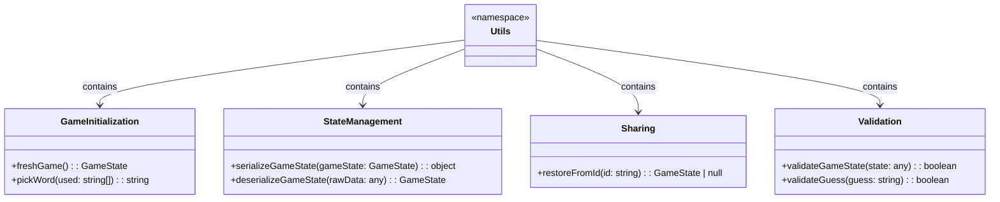

# Adobe Game - Class Diagram

This document provides a comprehensive class diagram showing the structure and relationships of all components, hooks, types, and utilities in the Adobe Game application.

## Main Class Diagram

## Component Hierarchy Diagram

## State Management Flow

## Data Flow Architecture

## Hook Dependencies

## Component Props Interface

## Utility Functions Structure

## Key Design Patterns

### 1. Custom Hook Pattern

### 2. Component Composition Pattern

### 3. State Management Pattern

## Summary

The Adobe Game follows a clean, modular architecture with:

1. **Component-Based Design**: Reusable UI components with clear responsibilities
2. **Custom Hook Pattern**: Encapsulated business logic in the `useGame` hook
3. **Type-Safe Development**: Comprehensive TypeScript interfaces
4. **State Management**: Immutable state updates with automatic persistence
5. **Utility Functions**: Pure functions for data processing and validation
6. **Error Handling**: Graceful error recovery and validation

This architecture ensures maintainability, testability, and scalability while providing a smooth user experience. 