# Adobe Game - Sequence Diagrams

This document provides comprehensive sequence diagrams showing the key interactions and data flow in the Adobe Game application.

## Table of Contents

1. [Game Initialization Sequence](#game-initialization-sequence)
2. [User Input Sequence](#user-input-sequence)
3. [Guess Submission Sequence](#guess-submission-sequence)
4. [New Game Sequence](#new-game-sequence)
5. [Share Game Sequence](#share-game-sequence)
6. [State Restoration from Share URL](#state-restoration-from-share-url)
7. [Keyboard Event Handling Sequence](#keyboard-event-handling-sequence)
8. [Error Handling Sequence](#error-handling-sequence)
9. [Component Update Sequence](#component-update-sequence)

---

## Game Initialization Sequence

---

## User Input Sequence

---

## Guess Submission Sequence

---

## New Game Sequence

---

## Share Game Sequence

```mermaid
sequenceDiagram
    participant User
    participant App
    participant useGame
    participant Utils
    participant Clipboard
    participant Browser

    User->>App: Click "Share" button
    App->>useGame: makeShareId()
    useGame->>Utils: compress(gameData)
    Utils->>Utils: JSON.stringify({w, g, u, wn, ls})
    Utils->>Utils: compressToEncodedURIComponent()
    Utils-->>useGame: Compressed share ID
    useGame-->>App: Share ID
    
    App->>App: Construct share URL
    App->>Clipboard: writeText(shareURL)
    
    alt Clipboard API supported
        Clipboard-->>App: Success
        App->>App: Show "✓ Copied!" feedback
    else Clipboard API not supported
        Clipboard-->>App: Error
        App->>App: Show fallback feedback
    end
    
    App-->>User: Share feedback message
```

---

## State Restoration from Share URL

---

## Keyboard Event Handling Sequence

---

## Error Handling Sequence

---

## Component Update Sequence

---

## Data Flow Summary

The sequence diagrams above illustrate the key interactions in the Adobe Game:

1. **Initialization**: Game state is restored from URL, localStorage, or fresh start
2. **User Input**: Letters are processed and state is updated
3. **Guess Processing**: Guesses are evaluated and game state is updated
4. **State Persistence**: All state changes are automatically saved
5. **Sharing**: Game state is compressed and shared via URL
6. **Error Handling**: Corrupted state is detected and handled gracefully

These interactions ensure a smooth, responsive user experience with proper state management and error recovery.

---

## Technical Notes

### Mermaid Compatibility
These diagrams use Mermaid syntax and can be rendered in:
- GitHub (native support)
- GitLab (native support)
- Many documentation platforms
- VS Code with Mermaid extension
- Online Mermaid editors

### Key Components
- **App**: Main React component
- **useGame**: Custom hook managing game state
- **Grid**: Game board display component
- **Keyboard**: Virtual keyboard component
- **Utils**: Utility functions for state management
- **LocalStorage**: Browser storage for persistence

### State Management
- Immutable state updates
- Automatic persistence to localStorage
- URL-based state sharing
- Graceful error recovery

---

*Author: Sri Harsha Chintala*
*Email: shri.u2@gmail.com* 